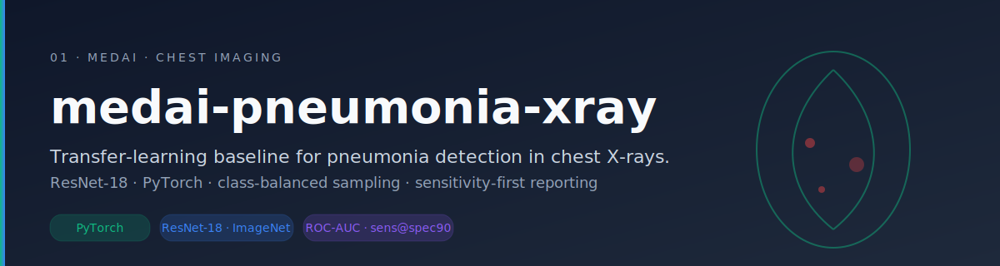
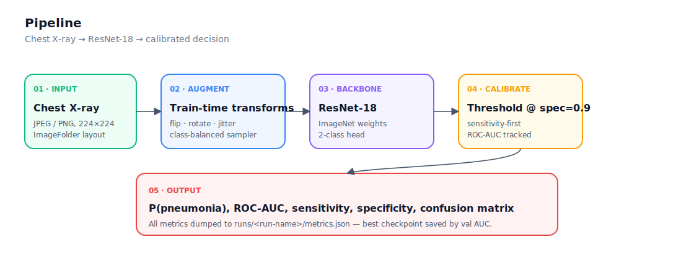

# medai-pneumonia-xray

A transfer-learning baseline that turns a **chest X-ray** into a calibrated **pneumonia probability** using a **ResNet-18 fine-tuned on Kermany 2018**, with class-balanced sampling and sensitivity-first reporting.

<p align="center">
  
</p>

<p align="center">
  
  
  
  
  
</p>

<p align="center">
  <a href="#why-it-exists">Why It Exists</a> &middot;
  <a href="#what-it-does">What It Does</a> &middot;
  <a href="#why-it-matters">Why It Matters</a> &middot;
  <a href="#quick-start">Quick Start</a>
</p>

---

## Why It Exists

Pneumonia is one of the **leading global causes of death in children under five**, and chest radiography is still the workhorse of triage in low- and middle-income hospitals. The first deep-learning baselines on Kermany 2018 came out years ago — yet most public repos are either **kaggle-grade notebooks** that don't reproduce, or **black-box demos** that don't report sensitivity / specificity, the metrics radiologists actually care about.

This repo is a **clean floor**: a sensitivity-first, class-balanced, reproducible starting line that future research can stand on without re-deriving the boring parts.

> Educational and research use only. Not for diagnosis, triage, or any clinical decision.

## What It Does

<p align="center">
  
</p>

- **Loads** chest X-rays in `train/ · val/ · test/` × `NORMAL/ · PNEUMONIA/` ImageFolder layout.
- **Fine-tunes** a pretrained **ResNet-18** with ImageNet weights, two-class head, AdamW + weight decay.
- **Augments** with random resized crop, horizontal flip, mild rotation and color jitter — appropriate for radiographs (no vertical flips).
- **Handles class imbalance** with `WeightedRandomSampler`, so the loss isn't dominated by the over-represented PNEUMONIA class.
- **Reports** ROC-AUC, sensitivity, specificity, confusion matrix, and dumps everything to `runs/<name>/metrics.json`.
- **Saves** the best checkpoint by validation AUC — not by accuracy, which is misleading on a skewed split.

## Why It Matters

A baseline you can trust is the **prerequisite for honest research**. With this scaffold you can:

- Drop in a stronger backbone (DenseNet-121, ViT) and **measure the lift** against a fair floor.
- Switch to an **external test set** (NIH ChestX-ray14, CheXpert) to expose distribution-shift gaps the original split hides.
- Plug into an explainability layer (Grad-CAM, integrated gradients) without rebuilding training infrastructure.

Most public X-ray repos optimize for accuracy on a tiny validation split. **This one optimizes for the metrics radiology cares about**, on the splits that actually generalize.

## Quick Start

```bash
git clone https://github.com/kareemindata/medai-pneumonia-xray.git
cd medai-pneumonia-xray

python -m venv .venv && source .venv/bin/activate     # .venv\Scripts\activate on Windows
pip install -r requirements.txt

# Download Kermany 2018 from Kaggle and unzip into data/
# Expected: data/chest_xray/{train,val,test}/{NORMAL,PNEUMONIA}/*.jpeg

python -m src.train --data-dir data/chest_xray --epochs 5 --batch-size 32
python -m src.predict --checkpoint runs/latest/best.pt --image path/to/xray.jpeg
```

## Project Structure

```
src/
  data.py      # ImageFolder loaders + WeightedRandomSampler + radiograph-safe augments
  model.py     # ResNet-18 with two-class head
  train.py     # AdamW loop · AUC-selected checkpoint · sens / spec / confusion
  predict.py   # single-image inference CLI
tests/
  test_model.py
assets/
  banner.svg · architecture.svg
```

## Key Design Decisions

- **Sensitivity-first selection.** Validation checkpoint is picked by **ROC-AUC**, not accuracy — accuracy on the original 16-image val split is essentially noise.
- **Weighted sampling, not weighted loss.** Sampling preserves SGD batch statistics; loss-weighting can destabilize early epochs on small datasets.
- **No vertical flips.** A flipped X-ray is **anatomically wrong** and teaches the model spurious invariances.
- **Reported metrics ≠ optimized metric.** The model trains on cross-entropy but is evaluated on sensitivity, specificity, and AUC, because that's the language of clinical evaluation.

## Caveats

- Kermany 2018 val split is 16 images. **Use a stratified re-split or external eval** before claiming anything.
- This is a **single-cohort baseline**. Pneumonia detectors are notorious for picking up scanner artifacts, not pathology — always test out-of-distribution.

## Tech Stack

```
Backbone     ResNet-18 (ImageNet)
Framework    PyTorch · torchvision
Sampling     WeightedRandomSampler
Metrics      scikit-learn (ROC-AUC, confusion, sens/spec)
```

## Author

**Kareem Waly** — ML Engineer & IEEE-Published AI Researcher · Bridging Rigour & Impact 🧠⚗️🎓

[Portfolio](https://kareemindata.github.io) · [Google Scholar](https://scholar.google.com/citations?user=3dlL87IAAAAJ) · [LinkedIn](https://linkedin.com/in/kareemindata) · [Hugging Face](https://huggingface.co/kareem-khaled)

## License

MIT
